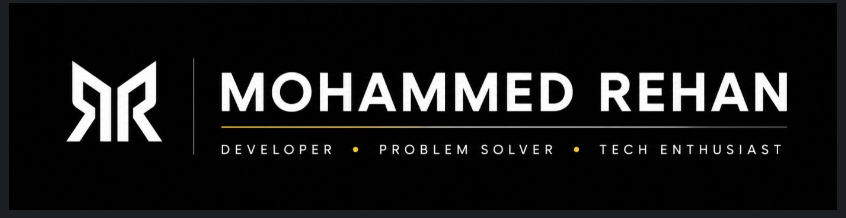

  

 

 

### 👨‍💻 About Me

I'm a B.Tech student at Vardhaman College of Engineering, Hyderabad. Alongside coursework, I build real, working products on my own — combining product thinking with AI-assisted development to move fast from idea to shipped, making the architecture and design calls myself.

- 🔭 Currently building things like **DoomGuard** and **MedicPal**
- 🌱 Currently exploring **AI-assisted prototyping** with Google AI Studio & Gemini
- 🎓 B.Tech Computer Science @ **Vardhaman College of Engineering (VCEH)**, 2025 – Present
- 📫 Reach me at **[rehanstudy4@gmail.com]**

 

### 🛠️ Tech Stack

 

 

 

### 📌 Featured Projects

<b>🔗 Click to expand</b>

 

**[DoomGuard](https://github.com/DoesntMatterICare/AntiDoomScroller)** · Apr 2026
Chrome extension that detects and neutralizes doomscrolling behavior in real time, using behavioral signals to intervene.
`Web Development` `Prompt Engineering`

**[MedicPal](https://github.com/DoesntMatterICare/MedicPal)**
AI-assisted medical mobile app that helps elderly and dementia patients remember their medicines and manage their health. Built with teammates **Mohammed Abdur Rehman** and others.
`Python` `TypeScript`

**[Virtual Workshop Lab](https://github.com/DoesntMatterICare/workshop)**
Viva-prep tool — identify tools from silhouettes, simulate carpentry joints, and wire live circuits. Associated with Vardhaman College of Engineering.
`UI Design` `Full-Stack Development`

 

### 📜 Certifications

- **Develop AI-Powered Prototypes in Google AI Studio** — Google (Aug 2026)
- **Learn Git and GitHub** — Scrimba (Aug 2026)
- *+3 more — see full list on LinkedIn*

 

### 📚 Publications

**[Outer Space as a Refrigeration Medium for Quantum Computing Infrastructure](https://github.com/DoesntMatterICare/QuantumSpaceCooling)** — Independent Research, Apr 2026
An independent hypothesis proposing that permanently shadowed lunar craters and deep-space environments could serve as passive cooling for quantum computing infrastructure.

 

### 📊 GitHub Stats

 

### 🤝 Connect With Me

 

⭐ From <a href="https://github.com/DoesntMatterICare">DoesntMatterICare</a> — thanks for stopping by!

